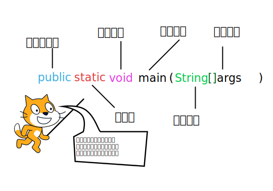
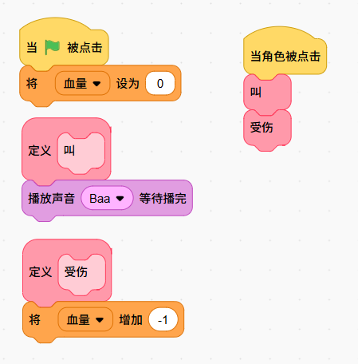

# 基础
一个 Java 程序可以被认为是一个对象集合。你要做的就是把问题抽象成很多个对象，然他们互相协同工作。
接下来开始讲Java的类和对象

# 第一个Java程序

喵喵，先做一个经典的“Hello World”程序来开启 Java 编程之旅吧喵！

* 创建文件: 首先，创建一个名为 HelloWorld.java 的文件。

* 编写代码: 在文件中输入以下代码：
```java
public class HelloWorld {
    /* 第一个Java程序
     * 它将输出字符串 Hello World
     */
    public static void main(String[] args) {
        System.out.println("Hello World"); // 输出 Hello World
    }
}
```

然后在命令行输入
```cmd
javac HelloWorld.java
java HelloWorld 

Hello World // 输出Hello World 喵喵喵
```

### 代码解读
* `public class HelloWorld:` 这是一个 类（class） 的声明。在 Java 中，所有代码都必须包含在一个类里。这个类的名字是 HelloWorld，它需要和文件名 HelloWorld.java 完全一致。

* `public static void main(String[] args)`: 这是 Java 程序的 主方法，或者说 入口点。当程序运行时，Java 虚拟机就是从这里开始执行的。

* `System.out.println("Hello World");`: 这行代码的作用就是向标准输出（通常是你的控制台）打印一行文本。



# 从 Scratch 到 Java ：类和对象

在 Scratch 中，你可能已经很熟悉`角色`和`克隆体`了。它们就是我们理解 Java **类和对象**的绝佳桥梁！他就像是一个阉割了的面向对象！

*   **类 (Class)**：就像是 Scratch 里的一个**角色**。它是一张**蓝图**或一个**模板**，定义了这个角色拥有哪些特征（比如血量、颜色），以及能做什么（比如跳跃、说话）。

*   **对象 (Object)**：就是从这个角色**克隆**出来的一个个**克隆体**。每个克隆体（也就是对象）都是一个独立的个体，有自己的生命，但它们都共享同一张蓝图，拥有蓝图里定义的所有能力。

一个对象主要由两部分构成：

#### **属性 (Properties/Attributes)**

这对应着 Scratch 角色的**私有变量**。每个克隆体（对象）都可以有自己独特的属性值。就像在游戏中，每个怪物克隆体都有各自的位置、血量，它们互不影响。

#### **行为 (Behaviors/Methods)**

这对应着 Scratch 的**自定义积木**。每个克隆体（对象）都可以调用这些定义好的行为来完成动作，比如“受伤”或“叫喊”。

简单来说，类是模板，对象是实体。你的任务就是设计好模板，然后用它来创造出无数个可以互相协作的有趣实体。



看这张图！`血量` 就是我们定义的**属性**，而 `叫` 和 `受伤` 就是我们定义的**行为**。当这个角色被“克隆”时，在 Java 里，这个过程被称为**实例化 (Instantiation)**。每个实例化出来的克隆体（对象），都拥有自己独立的 `血量` 属性，也都能调用 `叫` 和 `受伤` 这两个行为。

```java
// Monster.java
// 这就是我们的怪物“蓝图”，也就是“类”
public class Monster {

    // 1. 属性 (对应Scratch的私有变量)
    int health; // 定义一个整数类型的属性，叫“血量”

    // 2. 行为 (对应Scratch的自定义积木)
    // 定义一个叫“受伤”的行为
    public void takeDamage() {
        health = health - 1; // 每次调用，血量就减少1
        System.out.println("嗷！我受伤了！现在的血量是: " + health);
    }

    // 定义一个叫“叫”的行为
    public void yell() {
        System.out.println("Baa!"); // 在控制台打印出叫声
    }
}
```

# 实例化

其实它对应的就是 Scratch 里的 `克隆` 积木。当我们有了 `Monster` 这个类（蓝图）之后，就可以用它来真正地“克隆”出活生生的、独立的怪物了。

孩子们，搞懂了`对象`和`类`那就继续深入，来讲点scratch里面没有的东西，那些被scratch简化掉的东西

# 继承（Inheritance）

现在我们已经会制作怪物蓝图了。但如果我想制作不同种类的怪物呢？比如一种会飞的怪物和一种在地上跑的怪物。按照之前的想法，我们得创建两个完全不同的类！

可是，它们都有很多重复的东西，比如都有“血量”属性，都会“受伤”。如果游戏里有20种怪物，那就要写20次一模一样的代码，这简直是场噩梦！

为了解决这个问题，Java 引入了一个超酷的概念：**继承**。

**继承**，就是让一个类（我们叫它**子类**）去“继承”另一个类（我们叫它**父类**）的**属性**和**行为**。这样，子类就自动拥有了父类的所有能力，我们只需要在子类里添加它自己独有的新功能就行了。

*   **`Monster`** 就是**父类 (Parent Class)**，它定义了所有怪物通用的东西（血量、受伤）。
*   **`FlyingMonster`** 和 **`WalkingMonster`** 就可以是**子类 (Child Class)**。它们继承 `Monster`，然后再添加自己独特的能力，比如 `FlyingMonster` 可以有“飞行”行为。

```java
// FlyingMonster.java
// 使用 "extends" 关键字来表示继承关系
public class FlyingMonster extends Monster {

    // 它自动拥有了父类 Monster 的 health 属性和 takeDamage(), yell() 行为
    // 我们只需要给它添加独有的新行为

    public void fly() {
        System.out.println("我飞起来了！咻~");
    }
}

// ---- 在 Main.java 中使用它 ----
public static void main(String[] args) {
    // 实例化一个“飞行怪物”
    FlyingMonster harpy = new FlyingMonster();
    
    harpy.health = 120; // 可以使用从父类继承来的 health 属性
    harpy.takeDamage(); // 也可以调用从父类继承来的 takeDamage() 行为
    harpy.fly();        // 还能调用它自己独有的 fly() 行为
}
```

### 继承的魔法：方法重写（Override）

继承最神奇的地方在于，子类不仅能继承父类的行为，还能**修改**它！这在 Java 里叫做**方法重写（Override）**。

**重写**（Override）是指子类定义了一个与父类中具有**相同名称、参数列表和返回类型**的方法，并且子类方法的实现**覆盖**了父类方法的实现。

**即外壳不变，核心重写！**

比如，我们的 `Monster` 父类有一个通用的“受伤”行为。但是，如果 `WalkingMonster` 是一种有盔甲的怪物，它的“受伤”行为就应该不一样，比如受到伤害时先减免一部分。

这时，我们就可以在 `WalkingMonster` 子类里，**重写（Override）**受伤这个行为，让它变成带有盔甲减伤的效果。

```java
// ArmoredMonster.java
public class ArmoredMonster extends Monster {

    // 使用 @Override 注解是一个好习惯，它告诉编译器：
    // “我就是要重写父类的这个方法，你帮我检查下名字有没有写错！”
    @Override
    public void takeDamage() {
        // 重写后的行为：先打印不同的话，并且只掉0.5的血...哦不对，血量是整数
        // 那就让它的防御力更高，比如伤害减半，或者有特殊音效
        health = health - 1; // 假设它还是掉1点血
        System.out.println("叮！攻击被盔甲挡住，但还是受伤了！剩余血量: " + health);
    }
}

// ---- 在 Main.java 中对比一下 ----
public static void main(String[] args) {
    Monster normalMonster = new Monster();
    normalMonster.health = 50;
    
    ArmoredMonster strongMonster = new ArmoredMonster();
    strongMonster.health = 50;

    System.out.println("--- 普通怪物受伤 ---");
    normalMonster.takeDamage(); // 输出: 嗷！我受伤了！...

    System.out.println("\n--- 盔甲怪物受伤 ---");
    strongMonster.takeDamage(); // 输出: 叮！攻击被盔甲挡住...
}
```
看到没？同样是调用 `takeDamage()`，但不同的对象表现出了不同的行为，这就是重写的力量！


---

### 总结：`is-a` 关系

继承的核心思想是一种“**is-a**”（是一个）的关系：

* `FlyingMonster` **是一个** `Monster`。
* `WalkingMonster` **是一个** `Monster`。

这说明**父类更通用，而子类更具体**。你可以把所有怪物都看作是 `Monster`，但它们各自又有着独特的身份。这种关系能让我们的代码结构更清晰，也更容易维护。


---

接下来，我们会继续探索面向对象的其他几个核心概念：

*   **封装 (Encapsulation)**：如何更好地保护对象内部的数据。
*   **多态 (Polymorphism)**：继承带来的最强大的特性之一。
*   **抽象类 (Abstract Class)** 和 **接口 (Interface)**：设计更强大的蓝图。

我们慢慢来，一步999999亿个脚印。