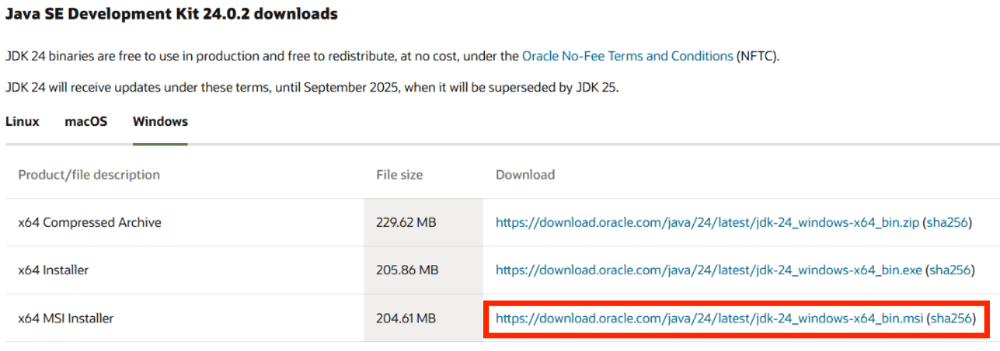
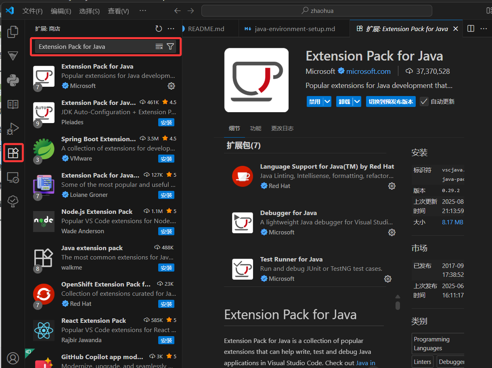

# 开发环境配置

这篇就是配置开发环境，你的操作系统是windows对吧，那就开始吧喵喵

这个教程我尽量写的简单，朝华酱这么聪明一定能很快就学会！喵喵！我喜欢你！

# 1.下载JDK

JDK是Java开发的核心，它包含了Java编译器（javac）、Java虚拟机（JVM）和Java类库。
在这里下载
<https://www.oracle.com/java/technologies/downloads/>

选择windows，然后选择最下面的mis

# 2.安装JDK

傻瓜式操作：
* 双击下载的 .msi 文件。

* 遵循安装向导的提示，点击“下一步”。

* 请务必记下JDK的安装路径。默认路径通常是 C:\Program Files\Java\jdk-xx.x.x (其中 xx.x.x 是版本号)。这个路径在下一步配置环境变量时至关重要。

# 3.配置环境变量

这是最关键的一步。配置环境变量是为了让操作系统在任何目录下都能找到 java 和 javac 等命令

### 打开环境变量设置

* 打开环境变量设置：

* 右键点击 “此电脑” -> 选择 “属性”。

* 在打开的窗口中，点击 “高级系统设置”。

* 在新弹出的“系统属性”窗口中，点击 “环境变量” 按钮。

### 新建 JAVA_HOME

* 在 “系统变量” 区域，点击 “新建”。

* 变量名: JAVA_HOME

* 变量值: C:\Program Files\Java\jdk-17.0.1 (这里必须替换成您自己的JDK安装路径)。

* 点击 “确定”。

### 编辑 Path 变量：

* 在 “系统变量” 区域，找到并双击 Path 变量。

* 在编辑窗口中，点击 “新建”。

* 输入 %JAVA_HOME%\bin。

* 点击 “确定”，然后一路确定关闭所有对话框。

ok 到这里就安装好了！

### 安装VSCODE

需要一个编辑器，可以用vscode

<https://code.visualstudio.com/download>

安装好vscode了之后，进入vscode搜索一个叫做 Extension Pack for Java 的插件，这样就能编写java就能更方便！

喵喵